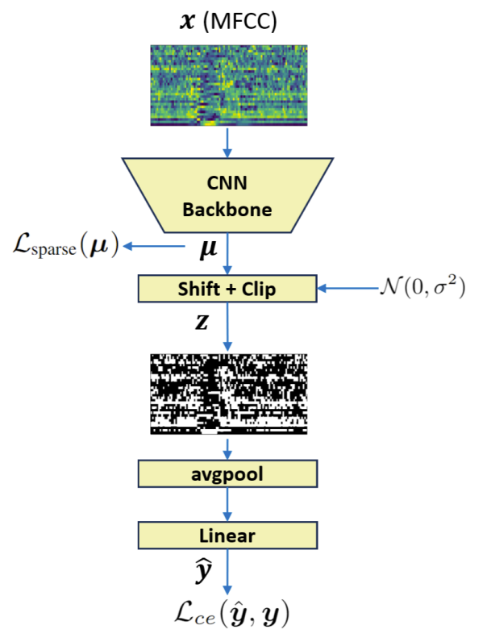

# SparkNet: Sparse Binarization for Fast Keyword Spotting (Interspeech 2024)

The paper is [here](https://www.isca-archive.org/interspeech_2024/svirsky24_interspeech.pdf).

## Main features:

* **Efficient (Tiny and Fast) Neural Network**
* **SOTA results in edge-device setup for KWS task**
* **Appropriate for micro-controllers** 

The code will be released soon.

### Model:

### Results:
Comparison of different methods trained on Google Speech Commands v1, v2 (SC1, SC2) datasets and tested on the official test set of keyword spotting task with 12 targets. While being with the same accuracy and number parameters our model has x4 less multiply-accumulate operations (MACs)

| **Model**                       | **Params** | **MACs**   | **SC1**             | **SC2**             |
|---------------------------------|------------|------------|---------------------|---------------------|
| TinySpeech-X [Wong et al. 2020] | 10.8K      | 10.9M      | 94.6 ± 0.00         | -                   |
| res8-narrow [Tang et al. 2018]  | 19.9K      | 5.65M      | 90.1 ± 0.98         | -                   |
| DS-ResNet10 [Xu et al. 2020]    | 10K        | 5.8M       | 95.2 ± 0.36         | -                   |
| BC-ResNet-1 [Kim et al. 2021]   | 9,232      | 3.6M       | **96.6** ± 0.21     | 96.9 ± 0.30         |
| **SparkNet[C=32]**              | **11,500** | **1.2M**   | 96.2 ± 0.19         | **97.0** ± 0.18     |
| TinySpeech-Z [Wong et al. 2020] | 2.7K       | 2.6M       | 92.4 ± 0.00         | -                   |
| BC-ResNet-0.625 [Kim et al. 2021] | 4,585      | 1.9M       | 95.2 ± 0.37         | 95.4 ± 0.31         |
| **SparkNet[C=16]**              | **4,636**  | **454.5K** | **95.3** ± 0.33     | **95.7** ± 0.17     |

### Reduced versions:

he accuracy of the proposed model as a function of number of parameters. The smallest model is still able to produce ~ 83\% accuracy by using only 1.4K parameters and 105K MACs.

| **Model Version**   | **Params** | **MACs**  | **SC1**            | **SC2**            |
|---------------------|------------|-----------|--------------------|--------------------|
| SparkNet[C=32]     | 11,500     | 1.2M      | 96.2 ± 0.19        | 97.1 ± 0.30        |
| SparkNet[C=16]     | 4,636      | 454.5K    | 95.3 ± 0.33        | 95.7 ± 0.30        |
| SparkNet[C=8]      | 2,292      | 190K      | 91.6 ± 0.76        | 92.1 ± 0.33        |
| SparkNet[C=4]      | 1,416      | 105K      | 82.3 ± 1.91        | 83.5 ± 0.60        |

This markdown table retains the structure and formatting of your original LaTeX table, with columns for model version, parameters, MACs, and accuracy (SC1 and SC2).

