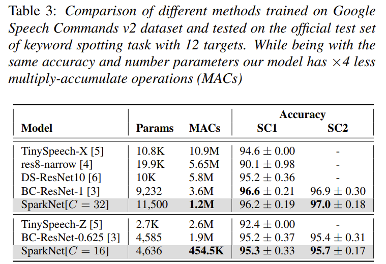
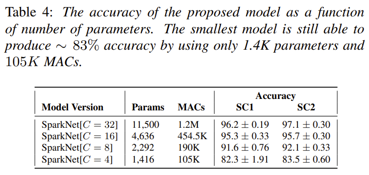

# SparkNet: Sparse Binarization for Fast Keyword Spotting (Interspeech 2024)

The paper is [here](https://www.isca-archive.org/interspeech_2024/svirsky24_interspeech.pdf).

## Main features:

* **Efficient (Tiny and Fast) Neural Network**
* **SOTA results in edge-device setup for KWS task**
* **Appropriate for micro-controllers** 

The code will be released soon.

### Model:

### Results:

### Reduced versions:

